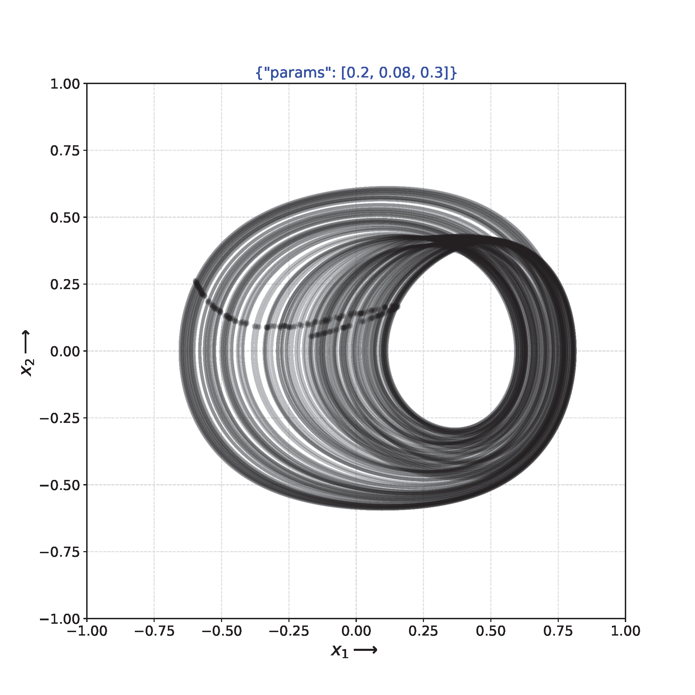
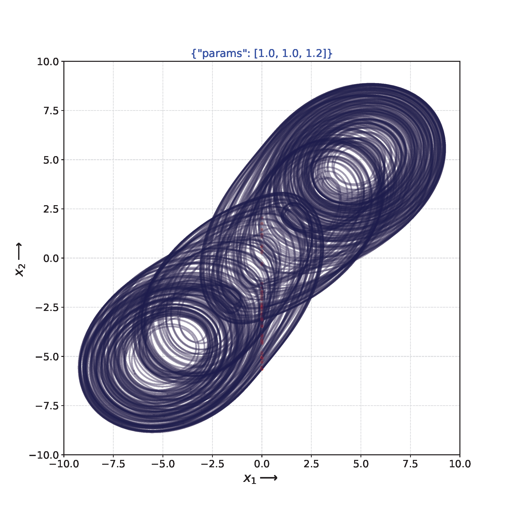

# `pputils` --- an ODE simulator utility

## Overview
For numerical simulation of an $n$-dimensional ordinary differential equation (ODE),this simulator allows: 
* no time limit integration
* real-time parameter change
* attemping various initial values by clicking a pointer
* taking a snapshot anytime
* reporting current state, parameter values, period information

This repository contains two types of simulators: `pp_na.py` for a non-autonomous system, and `pp_a.py` for an automonous system. The settings are decribed in a JSON file. The ODE can be written in this setting file, that is, you can share a sigle `pp*.py` with various setting file s with different ODEs.

## Requirements
* python 3.8 later
* numpy, scipy
* matplotlib

## How to install

In the top of repository, do

	% pip3 install -e .

In your own script, you can import `pptools` by declaring

`from pputils import pptools`

## pp_na --- for non-autonomous systems

Display a phase portrait of the given nonautonomous ODE. 

### Files
* pp_na.py: a simulator 
* duffing.json: a sample setup file for Duffing equation

### To exec

    % python pp.py duffing.json

### Setup file configuration

* `fun`: a list of the right hand side of the ODE.
* `x0`:	a list of initial values
* `params`:	a list of parameter values
* `dparams`: a list of incremental values corresponding to the parameters
* `xrange`, yrange: $x$ and $y$ ranges of the graph
* `tick`: a time step for drawing a curve
* `alpha`:  transparency value, zero to one.

### variables and parameters in fun()

* `x[0]`, `x[1]`, ...: state variables
* `p[0]`, `p[1]`, ...: parameters 

### How to use
#### mouse operation 

- A new initial values is given by clicking on the appropriate location
in the graph.
 
#### key operation

- `s`: print the current status
- `f`: show/hide trajectory (toggle)
- `w`: print the dictionary and dump it to `__ppout__.json` and taking a snapshot into `snapshot*.pdf` 
- `p`: change the active parameter index (default: 0, toggle)
- up and down arrows: increase/decrease the active parameter value
- `space` or `e`: clear transitions
- `q`: quit 

## pp_a.py --- for autonomous systems

Display a phase portrait of the given autonomous ODE. 

### Files
* `pp_a.py`: an simulator 
* `ebvp.json`: a sample setup file for the extended BVP equation (3rd order ODE)

### To exec

    % python pp_a.py ebvp.json

or, if you could add an excutable permission to `pp.py`, 

    % ./pp.py in.json

### Setup file configuration

* `fun`: a definition of the right hand of the ODE.
* `x0`:	a list of initial values
* `params`:	a list of parameter values
* `dparams`: a list of incremental values corresponding to the parameters
* `tick`: a time step for drawing a curve
* `p_index`, `p_location`: Poincare section definition. x[p_index] - p_location = 0
* `xrange`, `yrange`: $x$ and $y$ ranges of the graph
* `dump_data`: `false` write nothing, `true` write data to a file.
* `alpha`:  transparency value, 0 < alpha < 1

### How to use
#### mouse operation

- A new initial value can be given by clicking on the appropriate location
in the graph.

#### key operation

- `s`: print the current status
- `f`: show/hide trajectory (toggle). Poincare mapping points remain.
- `w`: print the dictionary into `__ppout__.json` and save `snapshot.pdf`
- `p`: change the active parameter index (default: 0, toggle)
- up and down arrows: increase/decrease the active parameter value
- `space` or `e`: clear transitions
- `+`, `-`: change the coordinate system, $(x, y) \rightarrow (y, z) \rightarrow (z, x)$, toggle.
- `q`: quit

